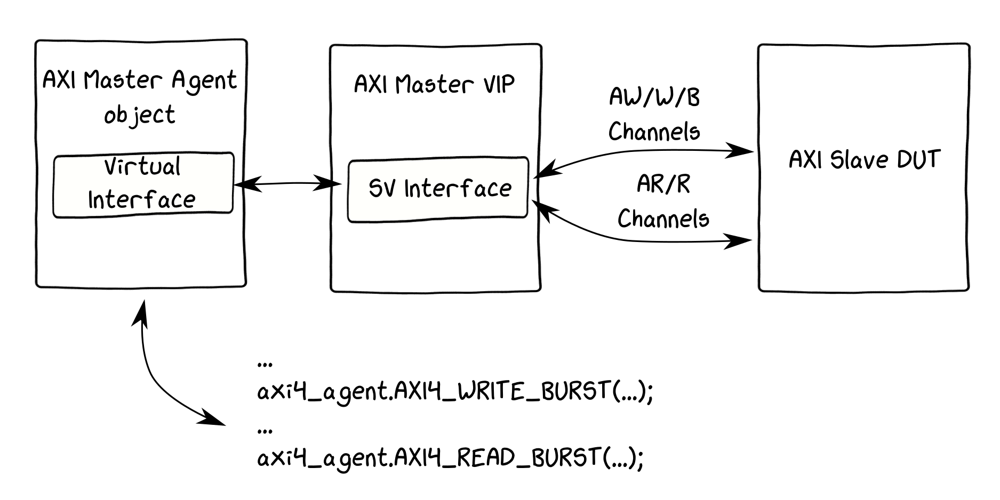

# Xilinx AXI Verification IP (VIP) demo

## AXI Slave verification example



### Sources

* ```src/axi_vip_master``` - AXI VIP Master - generated from Vivado -> IP Catalog -> AXI Verification IP
* ```src/axi_ram``` - RAM with AXI Slave interface (from [here](https://github.com/alexforencich/verilog-axi/blob/master/rtl/axi_ram.v))
* ```src/xilinx_vip``` - from ```$XILINX_DIR/Vivado/2019.2/data/xilinx_vip``` directory
* ```src/tb``` - testbench where all the components are instantinated

### Simulation

Simulation in Vivado XSim can be started from ```sim``` folder. Scripts overview:

* ```clean.sh``` - to remove all simulations artifacts
* ```elab.sh``` - to elaborate all sources (Xilinx VIP is used as a library)
* ```elab_nolib.sh``` - to elaborate all sources (Xilinx VIP sources are used - may be used as an example of how to run in other sim)
* ```sim.sh``` - start simulation
* ```run.sh``` - wrapper script; do elaboration and start simulation; optional argument ```nolib``` can be provided to choose the second elaboration script

## Useful links

* [AXI Basics 2 - Simulating AXI interfaces with the AXI Verification IP (AXI VIP)](https://forums.xilinx.com/t5/Design-and-Debug-Techniques-Blog/AXI-Basics-2-Simulating-AXI-interfaces-with-the-AXI-Verification/ba-p/1053935)
* [PG267 - AXI Verification IP v1.1 Product Guide (v1.1)](https://www.xilinx.com/support/documentation/ip_documentation/axi_vip/v1_1/pg267-axi-vip.pdf)
* [PG277 - AXI4-Stream Verification IP v1.1 Product Guide (v1.1)](https://www.xilinx.com/support/documentation/ip_documentation/axi4stream_vip/v1_1/pg277-axi4stream-vip.pdf)
* [PG291 - Clock Verification IP v1.0 Product Guide (v1.0)](https://www.xilinx.com/support/documentation/ip_documentation/clk_vip/v1_0/pg291-clk-vip.pdf)
* [PG298 - Reset Verification IP v1.0 Product Guide (v1.0)](https://www.xilinx.com/support/documentation/ip_documentation/rst_vip/v1_0/pg298-rst-vip.pdf)
* [PG101 - AXI Protocol Checker v2.0 Product Guide (v2.0)](https://www.xilinx.com/support/documentation/ip_documentation/axi_protocol_checker/v2_0/pg101-axi-protocol-checker.pdf)
* [AXI VIP, AXI Stream VIP, Clock VIP, Reset VIP sources + API documentation (2019.1)](https://www.xilinx.com/support/documentation/ip_documentation/xilinx-vip-api-2019-1.zip)
* [AMBA 4 AXI4, AXI4-Lite, and AXI4-Stream Protocol Assertions User Guide](https://developer.arm.com/documentation/dui0534/latest/)


All those PDFs and ZIP can be also found in ```doc``` folder.
